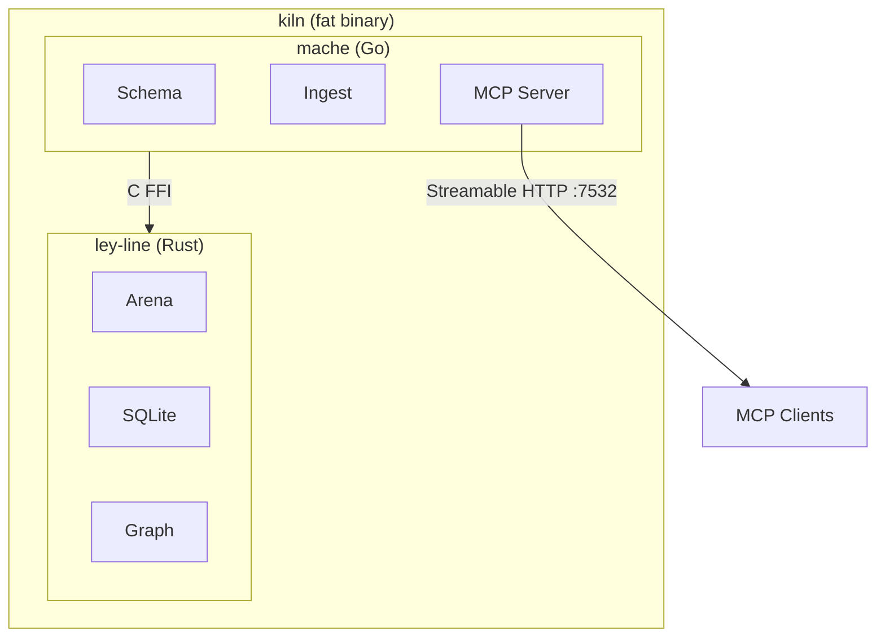

# kiln

Where you fire a mache.

## Install

```bash
brew install agentic-research/tap/mache
```

Then pick your editor — stdio mode is easiest (the editor manages the process,
auto-serves whatever project you're in):

### Claude Code

```bash
claude mcp add mache -- mache serve --stdio .
```

That's it. Claude Code spawns mache per-session and auto-detects your
project's languages. No server to manage.

### VS Code / Cursor

Add to `.vscode/mcp.json`:

```json
{
  "servers": {
    "mache": {
      "type": "stdio",
      "command": "mache",
      "args": ["serve", "--stdio", "."]
    }
  }
}
```

### Gemini CLI

Add to `~/.gemini/settings.json`:

```json
{
  "mcpServers": {
    "mache": {
      "command": "mache",
      "args": ["serve", "--stdio", "."]
    }
  }
}
```

### Windsurf

Add to `~/.codeium/windsurf/mcp_config.json`:

```json
{
  "mcpServers": {
    "mache": {
      "command": "mache",
      "args": ["serve", "--stdio", "."]
    }
  }
}
```

### HTTP mode (shared server)

If you prefer a long-running server that multiple clients can connect to:

```bash
# Serve a codebase (HTTP on :7532)
mache serve /path/to/your/code

# Or as a background service (macOS)
brew services start agentic-research/tap/mache
```

Then point your editor at `http://localhost:7532/mcp`:

```bash
# Claude Code
claude mcp add --transport http mache http://localhost:7532/mcp
```

```json
// VS Code / Cursor (.vscode/mcp.json)
{ "servers": { "mache": { "type": "http", "url": "http://localhost:7532/mcp" } } }

// Gemini CLI (~/.gemini/settings.json)
{ "mcpServers": { "mache": { "httpUrl": "http://localhost:7532/mcp" } } }

// Windsurf (~/.codeium/windsurf/mcp_config.json)
{ "mcpServers": { "mache": { "serverUrl": "http://localhost:7532/mcp" } } }
```

### Container mode

For environments without a local install:

```json
{
  "mcpServers": {
    "mache": {
      "command": "docker",
      "args": [
        "run", "-i", "--rm",
        "-v", "${workspaceFolder}:/source:ro",
        "-v", "mache-cache:/data",
        "mache", "--stdio", "/source"
      ]
    }
  }
}
```

---

## Table of contents

- [What's inside](#whats-inside)
- [Building](#building)
- [Distribution](#distribution)
- [Architecture](#architecture)
- [License](#license)

Kiln packages [mache](https://github.com/agentic-research/mache) and
[ley-line](https://github.com/agentic-research/ley-line) into a single
artifact — either a static fat binary or a distroless OCI image. One
command gives you a fully wired MCP server backed by ley-line's zero-copy
arena.

## What's inside



## Building

All commands use [Task](https://taskfile.dev).

```bash
task binary       # Static fat binary (Go + Rust linked)
task image        # Dockerfile image (dev/iteration)
task apk          # melange + apko distroless image (release)
task sign         # cosign signature (uses signet KMS if available)
task test         # Smoke test
task shell        # Debug shell in container
task clean        # Remove artifacts
```

### Build requirements

**Binary**: Go 1.25+, Rust 1.82+, C compiler.
**Image** (Dockerfile): Docker or Podman. No local toolchains.
**Image** (apko): melange, apko. Produces reproducible distroless images.

## Distribution

Three tiers, same binary inside:

| Method | Target | Size | Reproducible |
|--------|--------|------|--------------|
| `task binary` | Direct install, Homebrew tap | ~30MB | No (host-dependent) |
| `task image` | Dev, CI | ~200MB | No |
| `task apk` | Release, registry | ~15-20MB | Yes |

The apko path produces a distroless image: no shell, no package manager,
just the mache binary + musl libc + ca-certs. Signed with cosign, optionally
via signet's KMS provider.

## Architecture

Kiln is glue, not logic. It owns:

- **Build pipeline** — multi-language compilation + static linking
- **Packaging** — melange APK + apko OCI image assembly
- **Volume contract** — `/source` (read-only bind), `/data` (persistent cache)
- **Signing** — cosign + optional signet KMS integration

Kiln does NOT own:

- Schema logic, ingestion, tree-sitter queries (that's mache)
- Arena format, double-buffering, SQLite adapter (that's ley-line)

## Why?

Mache is Go. Ley-line is Rust. They talk via C FFI (`cgo` + `staticlib`).
Building locally requires both toolchains, a C compiler, platform-specific
FUSE/NFS libs, and the right CGO flags. Kiln absorbs that complexity so
users get one thing that works.

## Status

Early. The pieces exist — mache already links ley-line's staticlib via FFI.
Kiln just puts them in a box and fires it.

## License

Apache-2.0 (kiln and mache). Ley-line is closed-source.
